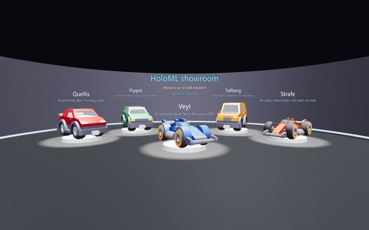
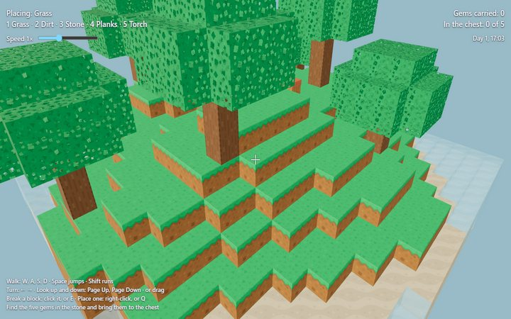
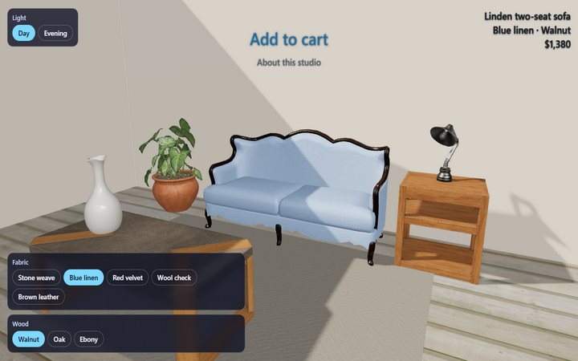
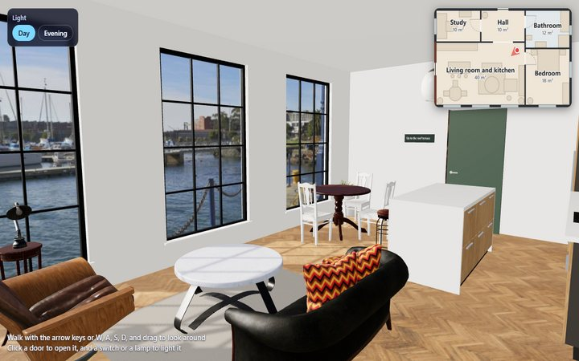
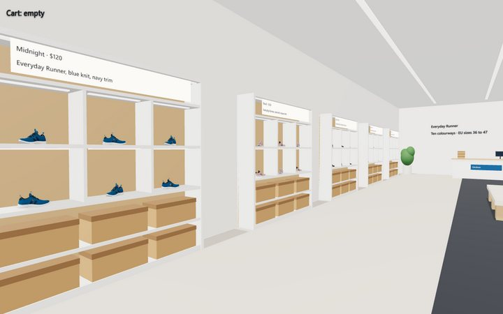
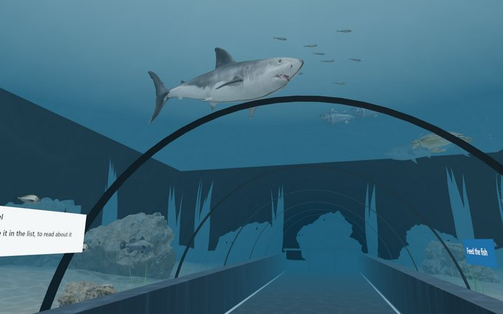

# HoloML

HoloML is a markup language for 3D web pages. A HoloML page describes a
scene (3D models, a place to stand, lights, text, links, sound, and
animation) in a syntax like HTML's, which you can write by hand. A
HoloML-aware browser, such as
[HyperSpace 3D](https://github.com/srajpal/hypersol-hyperspace-3d),
shows the scene as a space to orbit or walk around.

HoloML is experimental. It has one renderer so far, HyperSpace 3D, and
until version 1.0 a later version may change or remove what an earlier
one has. What a page written for 0.1 or 0.2 means will not change.

```holoml
<holoml version="0.2">
  <head>
    <title>A red car</title>
  </head>
  <scene background="#0b0f1e">
    <viewpoint position="0 1.6 6" look-at="0 0.8 0" mode="orbit" />
    <light type="ambient" intensity="0.4" />
    <light type="directional" position="4 8 5" intensity="1.2" />
    <model src="models/coupe.glb">
      <material name="Paint" color="#c0182a" />
    </model>
    <label position="0 2.1 0">Drag to walk around the car</label>
  </scene>
</holoml>
```

## Read

- [The specification](../SPEC.md): HoloML 0.2, the language as a
  standard, with its grammar and the scene API.
- [Tutorials](tutorials/index.md): lessons that build a first page, then
  a first script.
- [How-to guides](how-to/index.md): one task each, such as adding sound,
  a door that opens, or water.
- [Reference](reference/index.md): the elements, the scene API, and the
  codes a checker reports, at a glance.
- [Explanation](explanation/index.md): why HoloML is as it is, and how a
  browser shows a page.

## The example sites

Each is a HoloML site you can open in HyperSpace 3D, and its source is
in the repository.

- 
  [The showroom](https://srajpal.github.io/holoml/showroom/) (0.1): five
  cars in a round hall, one on a turntable, each to walk around in three
  colours. [Source](../examples/showroom/).
- 
  [Blockworld](https://srajpal.github.io/holoml/blockworld/): a small
  block game, with a script, sound, day and night, and a speed slider.
  [Source](../examples/blockworld/).
- 
  [The sofa studio](https://srajpal.github.io/holoml/sofa-studio/): a
  shop page, where the sofa's fabric and wood change in place.
  [Source](../examples/sofa-studio/).
- 
  [Harbour Loft](https://srajpal.github.io/holoml/harbour-loft/): a flat
  to tour, with doors and lamps to click, panels, and a floor plan.
  [Source](../examples/harbour-loft/).
- 
  [The sneaker store](https://srajpal.github.io/holoml/sneaker-store/): a
  shoe in ten colourways on shelves that load as you come near.
  [Source](../examples/sneaker-store/).
- 
  [The ocean tunnel](https://srajpal.github.io/holoml/aquarium/): an
  aquarium to walk through, with 30 fish, water, and feeding.
  [Source](../examples/aquarium/).

The pictures were taken in HyperSpace 3D; the models in them are
credited in each site's `models/CREDITS.md`.

## Licences

The specification is licensed under CC BY 4.0, and the code, the tools,
and these guides under Apache 2.0. The example sites' models, pictures,
and sounds keep their own licences, CC0 or CC BY 4.0, as each site's
credits say.
